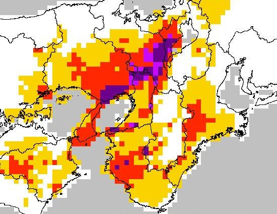

# Processing JMA landslide risk data

In this repository, we provide some scripts to handle the numerical landslide risk assessment figures prepared in 10-minute intervals by the Japan Meteorological Agency (JMA). This data is  *not freely available data*, but must rather be purchased from the Japan Meteorological Business Support Center (JMBSC), which operates under the oversight of the JMA. Here are a couple relevant links:

- Up to date visualized plot of landslide risk figures:<br> https://www.jma.go.jp/jp/doshamesh/

- JMBSC page for landslide risk data set:<br> http://www.jmbsc.or.jp/jp/online/file/f-online60210.html



This data is only provided in a standard binary format used frequently in meteorology, called *FM92 GRIB version 2*. The software in this repository assumes that the user has already acquired such data via the appropriate channels.

__Author and maintainer:__<br>
<a href="https://feedbackward.com/">Matthew J. Holland</a> (Osaka University, Institute for Datability Science)


## Demo notebooks

- <a href="http://nbviewer.jupyter.org/github/feedbackward/dosha-mesh/blob/master/demo_binary_contents.ipynb">Digging into GRIB2 binary files (JMA landslide risk)</a>

- <a href="http://nbviewer.jupyter.org/github/feedbackward/dosha-mesh/blob/master/demo_usage.ipynb">Demo of reading, decompressing, and storing JMA landslide risk figures</a>


## Downloading tutorial materials

If you have `git`, then the recommended procedure is to run

```
git clone https://github.com/feedbackward/dosha-mesh.git
cd dosha-mesh
```

and then go to work, placing any data directories as sub-folderns within this newly created `dosha-mesh` directory.


